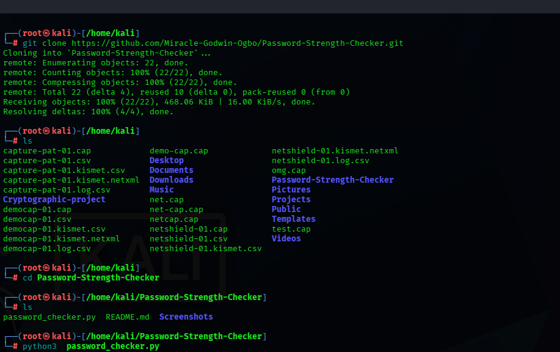
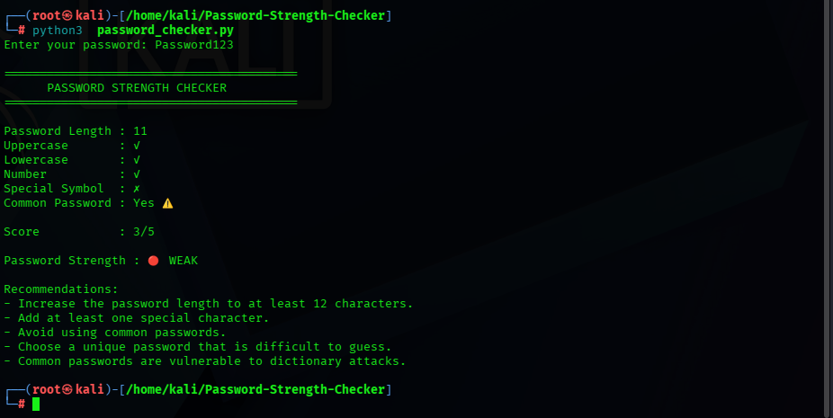
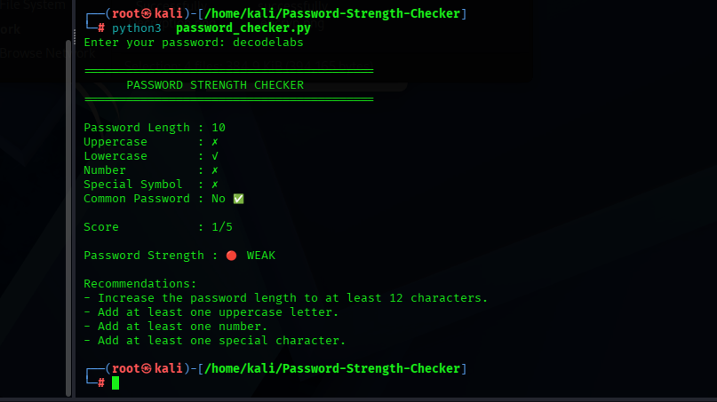
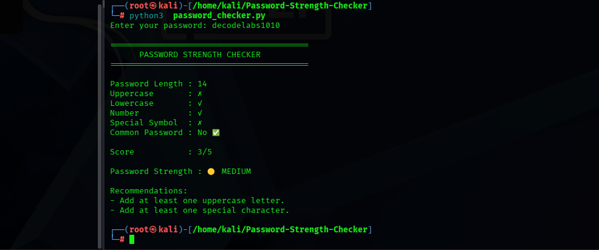
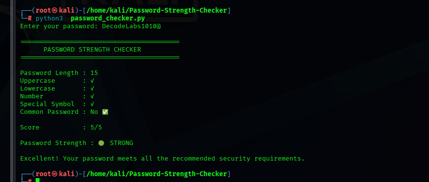
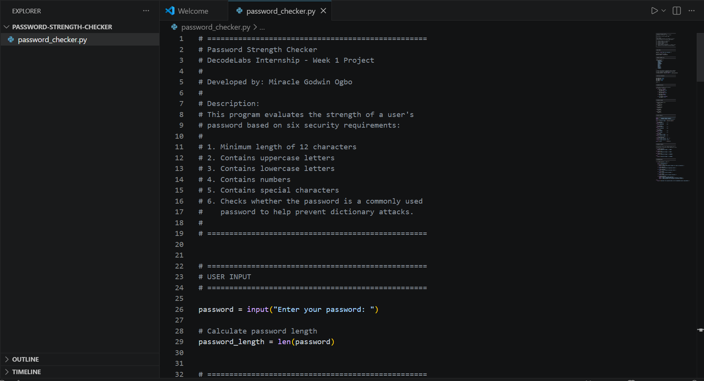
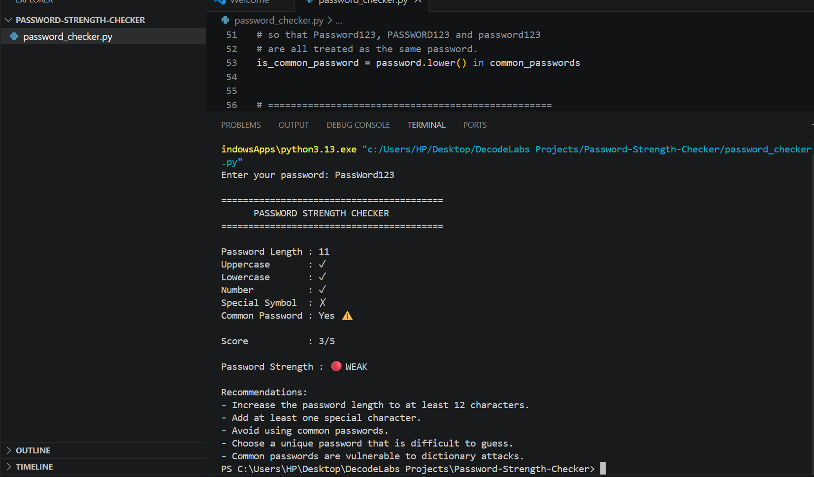
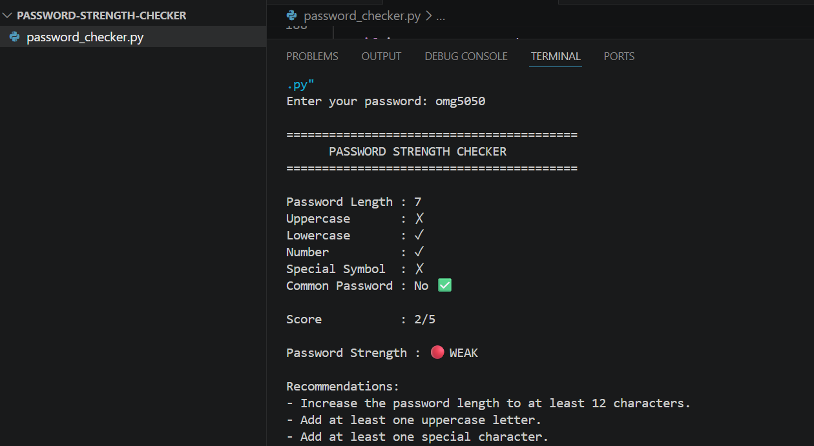
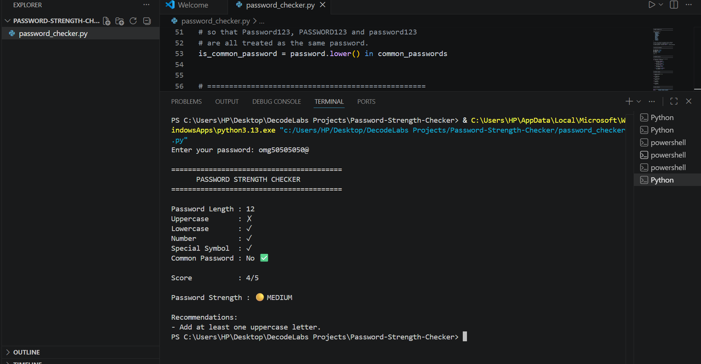
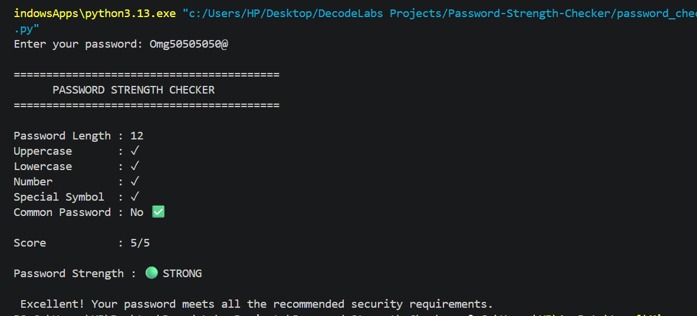

# Password Strength Checker


A Python-based security tool developed as part of my **DecodeLabs Internship (Week 1 Project)**.

This project evaluates the strength of user passwords by checking them against widely accepted cybersecurity best practices. It analyzes password complexity,detects commonly used passwords to help defend against dictionary and Bruteforce attacks, assigns a security score, and provides actionable recommendations to help users create stronger passwords.

As an aspiring cybersecurity professional, I developed this project to strengthen my Python programming skills while applying fundamental security concepts used in authentication and password security.

---

##  🎯 Project Objectives

- Apply Python programming to solve a real-world cybersecurity problem.
- Understand the importance of strong password policies.
- Demonstrate how weak and commonly used passwords increase security risks.
- Provide users with practical recommendations for creating secure passwords.
- Build a foundation for developing more advanced security tools in the future.

---

## ✨  Features

- Checks for a minimum password length of 12 characters.
- Detects uppercase letters.
- Detects lowercase letters.
- Detects numeric characters.
- Detects special characters.
- Identifies commonly used passwords.
- Automatically classifies common passwords as **Weak**.
- Calculates a password strength score (0–5).
- Categorizes passwords as **Weak**, **Medium**, or **Strong**.
- Provides security recommendations for improving weak passwords.
---


##  🛠  Technologies Used

- Python 3.13
- Visual Studio Code
- Windows PowerShell

---

##  📁 Project Structure

```
Password-Strength-Checker
screenshots
README.md
password_checker.py
```

---
## ▶️ How to Run

### 1. Clone the repository

```bash
git clone https://github.com/Miracle-Godwin-Ogbo/Password-Strength-Checker.git
```

### 2. Navigate to the project directory

```bash
cd Password-Strength-Checker
```

### 3. Run the program

**Linux (Kali Linux, Ubuntu, Debian, etc.)**

```bash
python3 password_checker.py
```

**Windows**

```bash
python password_checker.py
```

---

## 🐉 Running the Project on Kali Linux

The screenshots below demonstrate the project running successfully on Kali Linux.

### Successfully Cloning the Repository



---

### Common Password Assessment


---


### Weak Password Assessment



---

### Medium Password Assessment



---

### Strong Password Assessment



---

##  💻  Sample Output

```text
=========================================
      **PASSWORD STRENGTH CHECKER**
=========================================

Password Length : 12
Uppercase       : ✓
Lowercase       : ✓
Number          : ✓
Special Symbol  : ✓
Common Password : No ✅

Score           : 5/5

Password Strength : 🟢 STRONG

Excellent! Your password meets all the recommended security requirements.
```

---

## 📸  Screenshots

### 💻 Source Code



---


### ⚠️ Common Password Detection



---

### 🔴 Weak Password



---

### 🟡 Medium Password



---

### 🟢 Strong Password




---

##  🚀 Future Improvements

Future versions of this project may include:

- Integration with the Have I Been Pwned API to detect compromised passwords.
- Password entropy calculation based on randomness.
- Detection of keyboard patterns and repeated characters.
- Larger database of commonly used passwords.
- Password generation with customizable security policies.
- Graphical User Interface (GUI).
- Exporting password assessment reports.
- Integration into authentication systems as a password policy validator.

---

##  📚  What I Learned

Through this project, I strengthened my understanding of:

- Python variables
- Conditional statements (`if`, `elif`, `else`)
- Loops (`for`)
- Boolean logic
- String methods
- Lists
- Password security best practices
- Writing clean and well-documented code

---

## 👨‍💻 Author

**Miracle Godwin Ogbo**

Aspiring Penetration Tester | Cybersecurity Enthusiast | Python Developer

**Developed during the DecodeLabs Internship Program.**

---

>### "Security is not a product, but a process." – Bruce Schneier
